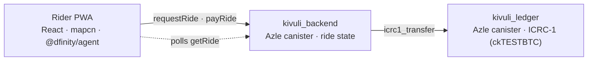
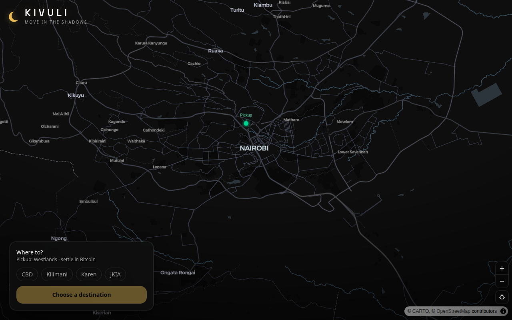
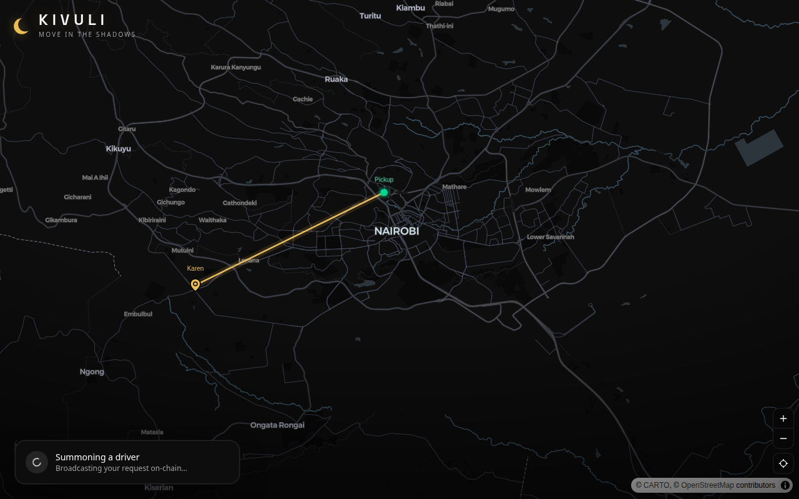
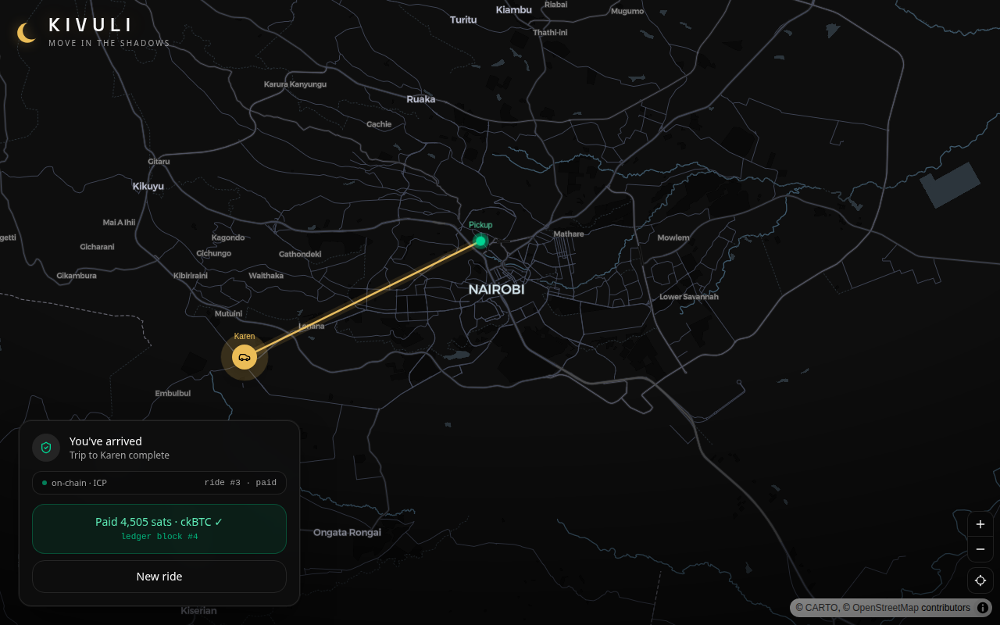

<h1 align="center">Kivuli 🌒</h1>

<p align="center">
  <b>Move in the shadows.</b><br/>
  A fully on-chain, privacy-forward ride-hailing concept — built entirely in TypeScript on the
  <a href="https://internetcomputer.org/">Internet Computer</a>, with fares settled in on-chain ckBTC.
</p>

<p align="center">
  
</p>

> **What this is:** a working *concept/prototype* exploring what ride-hailing looks like when the
> whole thing — dispatch state, settlement, hosting — lives on-chain, and the payment rail is
> Bitcoin (via ckBTC) instead of a card processor. It is **not** a live commercial service.

---

## Why it's interesting

- **Fully on-chain, 100% TypeScript.** Both canisters are written in TypeScript with
  [Azle](https://github.com/demergent-labs/azle) — no Motoko, no Rust. The React frontend is
  served from an ICP asset canister, so *nothing runs on a server you have to babysit.*
- **Real on-chain settlement.** Paying the fare triggers a genuine inter-canister
  `icrc1_transfer` — the ride canister moves ckBTC to the driver's wallet on-chain and gets back
  a ledger **block index**. No mock "payment successful" toast.
- **Beautiful maps out of the box** via [mapcn](https://mapcn.dev) (MapLibre + Tailwind, shadcn-style).
- **Live on-chain ride state.** The UI polls the canister and shows the ride's real status as it
  advances: `requested → accepted → intrip → completed → paid`.

## How it works



1. Rider opens the PWA, picks a destination — fare is estimated (distance × rate) and quoted in KES + sats.
2. `requestRide` writes the ride on-chain; a (simulated) driver accepts and animates to the pickup, then to the destination — positions and status transitions are pushed to the canister.
3. On arrival, **Pay** calls `payRide`, which performs a real `icrc1_transfer` from the ride canister's escrow to the driver's account and returns the ledger block index.

## Screenshots

| Hail | En route | Paid in ckBTC |
|---|---|---|
|  |  |  |

## Tech stack

| Layer | Choice |
|---|---|
| Backend canisters | **Azle 0.33** (TypeScript CDK for ICP) |
| Token / settlement | ICRC-1 ledger canister → **ckBTC**-style transfer |
| Frontend | **React + Vite + TypeScript**, Tailwind v4 |
| Maps | **[mapcn](https://mapcn.dev)** (MapLibre GL) |
| Chain | **Internet Computer** (`dfx`) |

## Run it locally

```bash
# 1. Start a local replica
dfx start --clean --background

# 2. Deploy the canisters
dfx deploy

# 3. Seed the ledger + wire the backend (one-time, after deploy)
BACKEND=$(dfx canister id kivuli_backend)
LEDGER=$(dfx canister id kivuli_ledger)
DRIVER=$(dfx identity get-principal)
dfx canister call kivuli_ledger faucet "(principal \"$BACKEND\", 100000000)"
dfx canister call kivuli_backend config "(\"$LEDGER\", \"$DRIVER\")"

# 4. Run the frontend
cd src/kivuli_frontend && npm install && npm run dev
# → http://localhost:3000
```

## Honest notes

- The **driver is simulated** — this demonstrates the full ride lifecycle without a second device.
- `kivuli_ledger` is a **minimal ICRC-1 ledger** standing in for the real mainnet **ckTESTBTC**
  ledger. The transfer is a genuine on-chain token movement; pointing at the real ckTESTBTC ledger
  is a mainnet-deploy step.
- No KYC / licensing / real-money handling — it's a prototype, framed as one.

## Roadmap

- [ ] Deploy to ICP mainnet + wire the real **ckTESTBTC** ledger
- [ ] A real driver app (second device) replacing the simulation
- [ ] Driver wallet / earnings history
- [ ] DAO governance of fares & routes

## Credits

Built with [Azle](https://github.com/demergent-labs/azle), [mapcn](https://mapcn.dev),
[MapLibre](https://maplibre.org/), and the [Internet Computer](https://internetcomputer.org/).
Basemaps © [CARTO](https://carto.com/) / © OpenStreetMap contributors.

## License

MIT
